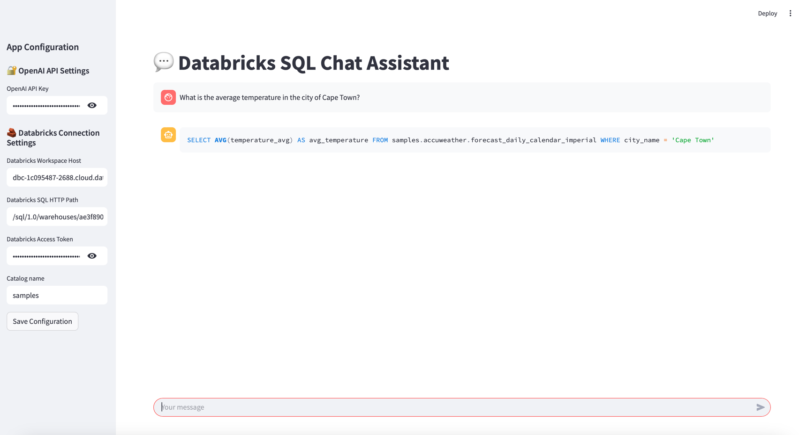

# 🧠 Build Your First AI Agent

Welcome! This short tutorial is designed to help **you** build your **first AI agent** that can understand structured information
and generate meaningful SQL queries.

This is not a black-box solution. Instead, we walk you through the **core ideas, decisions, and code** behind creating an agent
that interacts with **structured data**, particularly in enterprise environments using **Databricks SQL**.

By the end of this tutorial, you'll understand the building blocks of an agent that can bridge **LLMs** and **relational databases**—a critical step toward building AI copilots for enterprise applications.



## 🧪 What You'll Learn

✅ How to prompt an LLM to generate SQL queries  
✅ How to inject schema and domain knowledge into the prompt  
✅ How to connect and run SQL queries against Databricks  
✅ How to handle typical issues with structured data and LLMs

## 🛠️ Getting Started

### 1. Prerequisites

- Databricks account with a SQL Warehouse
- OpenAI (or similar) API key for LLM access

### 2. Clone the Repository

```bash
git clone https://github.com/fabclmnt/ai-tutorials.git
cd sql-agent
```

### 3. Build and Run the Container
```bash
docker build -t .
```

