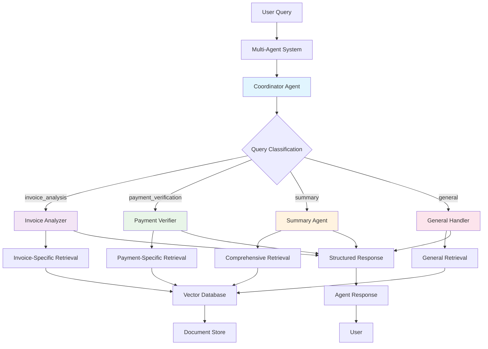

# From Single Agent to Multi-Agent Systems

## Overview

This document explains the evolution from a single RAG agent to a sophisticated multi-agent system in our document-based AI workshop. We'll explore the motivations, architecture, and benefits of this transition.

## Single Agent System

### Initial Architecture

Our starting point was a single AI agent that could answer questions about documents using a general-purpose retrieval tool and system prompt.

### Single Agent Capabilities

The single agent could handle various types of queries:
- Invoice analysis ("What is the total for invoice INV-1003?")
- Payment verification ("What payment methods are used?")
- General document search ("Find mentions of tax calculations")
- Cross-document queries ("Summarize all financial activity")

### Limitations of Single Agent Approach

While functional, the single agent had several limitations:

1. **Generic Responses**: All queries received the same level of analysis depth
2. **No Specialization**: One agent trying to be good at everything
3. **Limited Context Awareness**: Same retrieval strategy for all query types
4. **Scalability Issues**: As document types grew, performance could degrade
5. **No Query Routing**: No intelligent routing based on query intent

## Multi-Agent System Architecture

### Design Philosophy

The multi-agent system follows the principle of **specialization and coordination**:

- **Specialized Agents**: Each agent excels at specific types of queries
- **Intelligent Routing**: A coordinator determines which agent should handle each query
- **Shared Infrastructure**: All agents use the same vector database and document store
- **Fallback Mechanisms**: Graceful degradation when specialized agents aren't available

### System Components

#### 1. Dependencies Layer
Shared infrastructure that all agents use: vector database, document store, and configuration.

#### 2. Specialized Agents
- **Invoice Analyzer Agent**: Specializes in invoice analysis, line items, totals, and vendor information
- **Payment Verifier Agent**: Focuses on payment methods, transaction verification, and compliance
- **Summary Agent**: Provides high-level summaries, trend analysis, and pattern recognition

#### 3. Coordinator Agent
Intelligently classifies incoming queries and determines which specialized agent should handle them.

#### 4. Orchestration Layer
Manages the flow from query classification to agent routing and response aggregation.

## Agent Coordination Diagram

## Query Processing Flow

### 1. Query Classification
The coordinator agent analyzes the incoming query and determines its intent (invoice_analysis, payment_verification, summary, or general) along with a confidence score.

### 2. Agent Routing
Based on the classification, the system routes the query to the appropriate specialized agent that has the most relevant expertise.

### 3. Specialized Processing
Each specialized agent uses domain-specific retrieval strategies, applies relevant filtering, and provides focused analysis with structured responses and confidence scores.

## Benefits of Multi-Agent Architecture

### 1. **Specialization**

Each agent becomes an expert in its domain:
- **Invoice Analyzer**: Deep understanding of invoice structures, line items, totals
- **Payment Verifier**: Expertise in payment methods, transaction verification, compliance
- **Summary Agent**: Skilled at trend analysis, pattern recognition, high-level insights

### 2. **Improved Accuracy**

Specialized agents provide more accurate responses:
- Domain-specific prompts guide better reasoning
- Targeted retrieval reduces noise
- Focused analysis improves response quality

### 3. **Scalability**

Easy to add new specialized agents for different domains (compliance, legal, technical, etc.) without modifying existing agents.

### 4. **Confidence Scoring**

Each agent provides confidence metrics including agent type, response quality score, sources used, and reasoning for the classification.

### 5. **Fallback Mechanisms**

Graceful degradation when specialized agents fail:
- Fallback to general retrieval
- Clear error messages
- Maintained functionality

## Performance Comparison

### Single Agent Performance
- **Query**: "What payment methods are used?"
- **Response**: Generic document search results
- **Accuracy**: Moderate (finds relevant info but lacks payment-specific analysis)
- **Confidence**: Not measured

### Multi-Agent Performance
- **Query**: "What payment methods are used?"
- **Classification**: payment_verification (confidence: 0.9)
- **Agent**: Payment Verifier
- **Response**: Focused analysis of payment methods with specific examples
- **Accuracy**: High (specialized analysis)
- **Confidence**: 0.9

## Implementation Considerations

### 1. **Shared State Management**
All agents share the same vector database, document store, embedding model, and configuration for efficiency.

### 2. **Error Handling**
Robust error handling with graceful fallback to general retrieval when specialized agents encounter issues.

### 3. **Resource Efficiency**
Single vector index shared across all agents with reuse of embeddings and document processing for optimal memory usage.

### 4. **Monitoring and Debugging**
Comprehensive logging of query classification, agent routing, confidence scores, and reasoning for transparency and debugging.

## When to Use Multi-Agent Systems

### Use Multi-Agent When:
- **Multiple Document Types**: Invoices, contracts, reports, emails
- **Diverse Query Types**: Analysis, verification, summarization, compliance
- **High Accuracy Requirements**: Specialized analysis needed
- **Scalable Architecture**: Planning to add more capabilities
- **Complex Workflows**: Multi-step processes requiring different expertise

### Stick with Single Agent When:
- **Simple Use Cases**: Single document type, basic Q&A
- **Limited Resources**: Minimal computational overhead needed
- **Prototype Phase**: Rapid development and testing
- **Uniform Queries**: All queries are similar in nature

## Future Extensions

### 1. **Agent Communication**
Agents can call other agents for cross-domain analysis (e.g., invoice agent calling payment agent for verification).

### 2. **Dynamic Agent Creation**
Create specialized agents on-demand based on document types and user requirements.

### 3. **Agent Learning**
Track query patterns, improve classification accuracy, optimize retrieval strategies, and learn from user feedback.

## Conclusion

The transition from single agent to multi-agent systems represents a significant architectural improvement:

- **Better Accuracy**: Specialized agents provide more accurate, domain-specific responses
- **Improved Scalability**: Easy to add new capabilities and document types
- **Enhanced User Experience**: More relevant and focused answers
- **Maintainable Code**: Clear separation of concerns and responsibilities

This multi-agent approach provides a solid foundation for building production-ready document-based AI systems that can handle complex, diverse queries with high accuracy and reliability.

## Workshop Learning Objectives

By implementing this multi-agent system, workshop participants learn:

1. **Agent Specialization**: How to create domain-specific AI agents
2. **Query Routing**: Intelligent classification and routing strategies
3. **Shared Infrastructure**: Efficient resource sharing across agents
4. **Error Handling**: Graceful degradation and fallback mechanisms
5. **System Architecture**: Design patterns for scalable AI systems
6. **Performance Optimization**: Balancing accuracy with efficiency

This knowledge can be applied to various domains including legal document analysis, financial report processing, customer support automation, and more.
